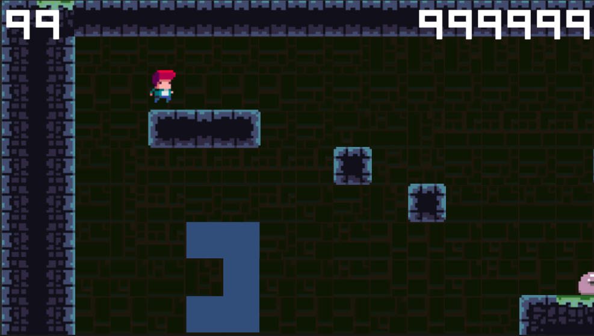

# Tile Vania

## Sprites

Lo primero, debemos seleccionar todos nuestros Sprites y **ajustar su tamaño en píxeles por unidad (`Pixels Per Unit`)**.

Esto, lo que hace, es cambiar el tamaño de los Sprites pero sin redimensionarlos. Los ajusta a la escala base de unidades de Unity. Este valor parte de 100, un valor inferior agranda el Sprite.

> Se recomienda que todos los sprites tengan el mismo valor. Si un sprite su PPU es de 32, el resto también.

Los Sprites, lo normal es que sean varias imágenes contenidas dentro de una sola imagen y separadas por grids. Para que Unity lo pueda identificar como tal. **Desde el inspector del Sprite cambiar el `Sprite Mode` de `Single` a `Multiple`**.

Entonces hacemos clic en el button `Sprite Editor`.

Se nos abrirá una ventana nueva. Arriba a la izquierda hacemos clic en `Slice` y en la ventana flotante podemos decidir como hacer los recortes. Probemos en `Type` con `Automatic` y luego clic en `Slice`. Esta puede ser la solución para la mayoría de los casos. 

En caso que el recorte automático no sea correcto tenemos otras opciones disponibles como `Grid By Cell Size`, etc. Lo importante es que aparecerán unas líneas rojas para previsualizar el recorte y modificando los parámetros podemos conseguir el corte correcto.

Una vez terminado de recortar debemos guardar los cambios haciendo clic en el button `Apply` ubicado en la esquina superior derecha de la ventana. 

Para confirmar que un Sprite tenga los cortes, desde el inspector de assets aparece una flecha apuntando hacia la derecha en cada Asset. Si hacemos clic sobre este se nos desplegará todos los Sprites recortados como individuales.

## Tilemap

Desde la jerarquía hacemos clic derecho → `2D Object` →`Tilemap` → `Rectangular`. Aparecerá un grid y en su interior el Tilemap. Además, el editor cambiará a ser cuadriculado.

Creamos una carpeta `Tiles` dentro de `Assets` desde el explorador y en Unity hacemos clic en `Window` → `2D` → `Tile Palette` y se nos abrirá una nueva ventana. Esta ventana podemos acoplarla, redimensionarla o dejarla tal cual.

Hacemos clic en `Create New Palette` y nos pedirá que seleccionemos una carpeta. Seleccionamos la carpeta que hemos creado previamente: `Tiles`.

Se nos añadirá una paleta creada dentro de ese directorio.

Dentro de la carpeta `Sprites` seleccionamos nuestro Sprite y desplegamos su contenido haciendo clic en la flecha apuntando hacia la derecha. Seleccionamos todos los sprites recortados y los arrastramos a la ventana del Tile Palette que acabamos de crear.

Nos pedirá guardarlo en algún sitio y seleccionamos la carpeta `Tiles`. Aparecerá su contenido que podemos editar, redistribuir, **rotar algún tile para que apunte a la izquierda y no solo a la derecha clonándolo y cambiando su escala a -1**, etc.

Seleccionamos la herramienta pincel de Tile Palette y dentro del editor de escena podemos pintar nuestro escenario.

**Si aparecen líneas blancas que separan los Tiles, para arreglarlo debemos cambiar el PPU del Tilemap a un dígito menos, modificándolo desde el Sprite que está dentro de la carpeta `Sprites`.** 

## Múltiples Tilemaps (capas)

Podemos crear varias paletas o trabajar sobre una sola (depende del contexto). Dentro del GameObject `Tilemap Grid` que hemos creado en la jerarquía debemos crear en su interior un nuevo Tilemap. Hacemos clic derecho → `2D Object` →`Tilemap` → `Rectangular`.

Desde el editor de `Tile Palette` (la nueva ventana) hay un menú desplegable debajo de las herramientas llamada `Active Tilemap` y podemos elegir el nuevo Tilemap que acabamos de crear. Una vez seleccionado podemos seguir pintando con tranquilidad.

En caso que se superpongan y quieras que aparezca un Tilemap detrás de otro debes seleccionar el GameObject Tilemap → `Inspector` → `Tilemap Renderer` → `Order in Layer`.

Una segunda forma es **crear capas `Sorting Layers` desde el inspector y añadir las capas que necesitemos. Entonces lo organizamos manualmente arrastrándolos y en donde aparece `Order in Layer` lo dejamos en 0 pero en `Sorting Layer` asignamos la capa.**

## Tile Rules

Debemos instalar el paquete desde `Window` → `Package Manager` →  `Unity Registry` → `Tilemap Extras`.

> Desde la versión 2021.3.8f1 este paquete se incluye al iniciar un proyecto 2D

Dentro de la carpeta `Sprites` hacemos clic izquierdo → `Create` → `2D` → `Tiles` → `Tile Rule` y se nos añadirá en el explorador. Renombramos a `Rule Tile` y al hacer clic aparecerá en el inspector. Seleccionamos cualquier Sprite y arrastramos en donde dice `Default Sprite`. Ahora que es visible seleccionamos nuestro Rule Time y lo arrastramos dentro de nuestra Paleta.

Lo seleccionamos desde la paleta y podemos pintar el escenario como cualquier otro Tile con el pincel. La diferencia es que si hacemos clic en el símbolo de **`+`** se nos añaden las reglas.

En el cuadro arrastramos el Sprite que queremos reglamentar y en la cuadrícula establecemos las restricciones.

- El punto del centro es cómo se va a representar el Tile: tal cual, rotado, simetría x, simetría y, o ambas
- La flecha verde es la regla que indica si debe haber un Tile existiendo en esa dirección
- La cruceta roja es la regla que indica si en ese cuadro no hay ningún tile
- Sin cruceta ni flecha verde quiere decir que da igual si hay algo o no

Por último, en la cuadrícula, el centro sería nuestro Tile y sus alrededores la regla.

Collider es precisamente si tendrá colisión por Tile o en conjunto.

En Output podemos elegir: 

- Single (el sprite asociado)
- Random (una lista de sprites aleatorio)
- Animation (un sprite animado)

## Animación

> [Complete C# Unity Game Developer 2D | Udemy](https://www.udemy.com/course/unitycourse/learn/lecture/28740520#content)

`Window` → `Animation` → `Animator`

- `Animator component` → Componente animación que se le asigna a un GameObject
- `Animator Controller`    → Arreglo de animaciones y transiciones (máquina de estados)
- `Animation` → Pieza específica de animación

- `Sprite Renderer` → dibuja el sprite 2D en la pantalla

**Pasos a seguir:**

- Importar el spritesheet y recortarlo
- Añadir sprite renderer a player
- Crear idle animation clip
- Crear character animator controller
- Añadir animacion a animator controller
- Añadir animator a Player
- Asignar character animator controller a Player